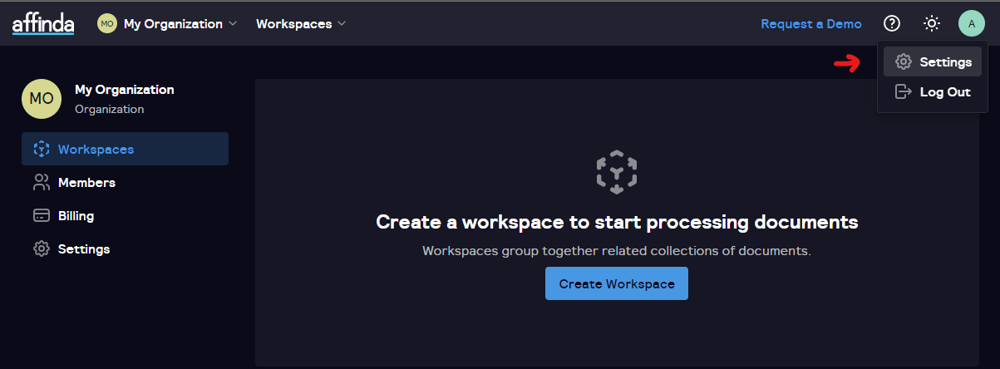
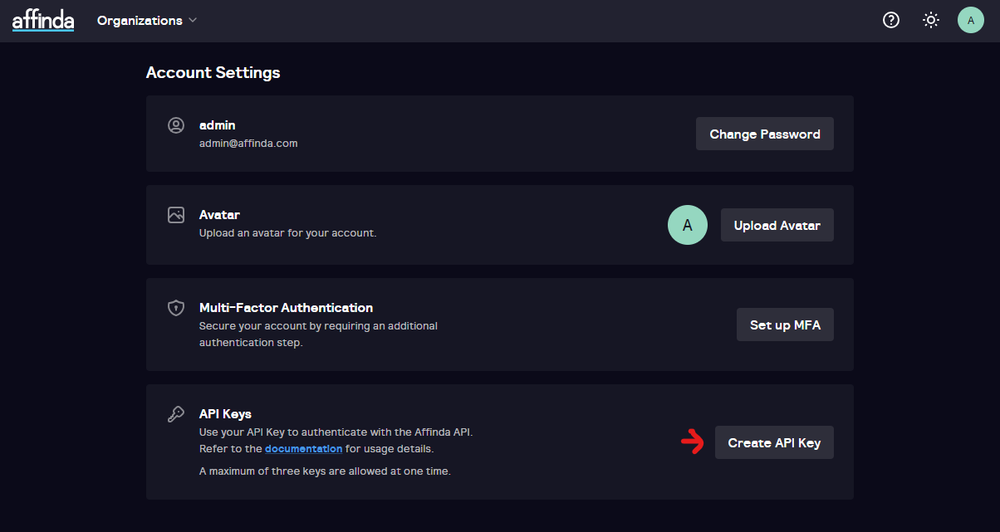

# Affinda Document Parser Self-Hosted

Affinda Resume Parser Self-hosted is a self-contained instance of Affinda’s document parsing API. It is designed
specifically for environments with stringent compliance, privacy, and security requirements, where the cloud hosted
API is not suitable. It can be deployed to your own self-managed infrastructure, where all processing is performed
strictly within.

The Affinda Document Parser is provided as set of docker containers. Once deployed, you can submit
parse requests via the API just like you would to the cloud hosted API. The API endpoints are identical, making
migration to/from and testing against our cloud endpoints simple.

This repository contains configurations that can be used to run the Affinda document parser in a local deployment.
Some instructions are AWS-specific, however running on other cloud platforms is also possible.

You will need access to the relevant Affinda repositories to run this code. Please contact sales@affinda.com.

Release notes for significant version changes can be [found in this repository here](./RELEASES.md)

## Installation

There are three supported approaches to configuring the service:

1. EC2 instance running docker compose
1. Docker compose running on an arbitrary linux instance, pulling from affinda's private docker hub
1. Elastic Container Service (ECS).

For organizations running a single instance, we recommend docker compose. For organizations running
many instances who may require auto-scaling of capacity based on demand, we recommend ECS.

### Docker compose on AWS EC2

1. Launch a new G4dn.2xlarge instance
   using [ami-0e60dbcf8a762bd42](https://ap-southeast-2.console.aws.amazon.com/ec2/v2/home?region=ap-southeast-2#ImageDetails:imageId=ami-0e60dbcf8a762bd42).
   The configuration is optimised for this instance type. We recommend running additional instances if you require
   higher throughput.
    1. If you are not running in the region of the AMI (ap-southeast-2), you will need to search the AMI catalog for
       `Deep Learning AMI GPU PyTorch 1.13.1 (Ubuntu 20.04)`
    1. If you are not using AWS, then launch an instance with NVIDIA GPU drivers and docker engine/compose installed.
    1. Install `docker` and `docker compose` manually or by running the `./install_os_dependencies.sh` script in this
       repo
    1. If installing `docker` for the first time, you'll need to restart your instance before continuing
1. Authenticate docker with AWS. Note that the affinda repositories are private. Contact sales@affinda.com for access.
   Additionally, the IAM role for this instance will need to have ECR permissions assigned.

    ```shell
    aws ecr get-login-password --region ap-southeast-2 | docker login --username AWS --password-stdin 335594571162.dkr.ecr.ap-southeast-2.amazonaws.com
    ```
1. Add the [docker compose](docker-compose.yml) file to your the home directory on the server. This could also be
   achieved by cloning this repository with `git clone git@github.com:affinda/self-hosted.git`
1. Update the `DJANGO_SECRET_KEY` environment variable wherever it appears in `docker-compose.yml`. We recommend
   using https://djecrety.ir/ to create a new key.
1. If not using a GPU, modify the `docker-compose.yml` as [per the instructions below](#how-do-i-disable-gpu-support)
1. Run `docker compose pull` and `docker compose up` to pull the containers and start the service.
1. Note that the first time it runs it will take approximately 5 minutes to complete initial database migrations.
1. You should now be able to access the admin login page at the IP address of the service (by
   default, `http://localhost/admin`).

### Docker compose on linux instance

1. Launch your instance, and using your package manager ensure `docker` and `docker compose` are installed. If running
   on a debian-based system, this can be done by running the `./install_os_dependencies.sh` script in this repo.
1. If installing `docker` for the first time, you'll need to restart your instance before continuing
1. Authenticate docker with the affinda Dockerhub repo. Note that the affinda repositories are private. Contact
   sales@affinda.com for access.

    ```shell
    docker login --username $DOCKERHUB_USERNAME
    ```
   Then provide your Dockerhub password.

1. Add the [docker compose](docker-compose-dockerhub.yml) file to your the home directory on the server and rename it
   to `docker-compose.yml`. This could also be achieved by cloning this repository
   with `git clone git@github.com:affinda/self-hosted.git`
1. Update the `DJANGO_SECRET_KEY` environment variable wherever it appears in `docker-compose.yml`. We recommend
   using https://djecrety.ir/ to create a new key.
1. If not using a GPU, modify the `docker-compose.yml` as [per the instructions below](#how-do-i-disable-gpu-support)
1. Run `docker compose pull` and `docker compose up` to pull the containers and start the services.
1. Note that the first time it runs it will take approximately 5 minutes to complete initial database migrations.
1. You should now be able to access the admin login page at the IP address of the service (by
   default, `http://localhost/admin`)

### Elastic Container Service (ECS)

1. Create a cluster with G4dn.2xlarge instances using
   ([ami-0e60dbcf8a762bd42](https://ap-southeast-2.console.aws.amazon.com/ec2/v2/home?region=ap-southeast-2#ImageDetails:imageId=ami-0e60dbcf8a762bd42)).
   If you are not running in the region of the AMI (ap-southeast-2), you will need to search the AMI catalog for
   `Deep Learning AMI GPU PyTorch 1.13.1 (Ubuntu 20.04)` to find the corresponding AMI for your region.
   Cluster creation can be done either through a browser, or using ecs-cli:
    1. If using a browser, create a new EC2 Linux + Networking cluster. You will not be able to specify the AMI
       at this step, the default amazon AMI will be automatically selected. After the cluster has been created, go to
       CloudFormation, select the stack relating to the cluster, update using the current template, and then change
       the EcsAmiId
       to [ami-0e60dbcf8a762bd42](https://ap-southeast-2.console.aws.amazon.com/ec2/v2/home?region=ap-southeast-2#ImageDetails:imageId=ami-0e60dbcf8a762bd42).
       You may then want to terminate any instances that were launched using the default amazon AMI.
    1. If using
       ecs-cli ([installation instructions](https://docs.aws.amazon.com/AmazonECS/latest/developerguide/ECS_CLI_installation.html)),
       you need to:
        1. Run `ecs-cli configure --region your-region --cluster your-new-cluster-name`
        1. Run the following to create a cluster in your VPC with appropriate subnets, IAM roles, etc.

    ```bash
    ecs-cli up \
          --keypair optional-if-you-want-ssh-access \
          --launch-type EC2 \
          --size 1 \
          --instance-type g4dn.2xlarge \
          --instance-role your-iam-role \
          --vpc your-vpc-id \
          --subnets your-comma-separated-subnet-ids \
          --security-group your-security-group-id \
          --image-id ami-0e60dbcf8a762bd42 \
          --region your-aws-region
    ```

1. When running in a cluster, it is preferable to have an external database for all the cluster instances to
   share. It is possible to simply include a database within each instance, however this will cause problems if you
   want to track usage across accounts connecting to the cluster, or if you are using our Search and Match platform. So,
   you should create a new postgresql database through RDS, or wherever you normally create databases.
1. Make a copy of [ECS-task-definition.json](ECS-task-definition.json) and update the database environment variables
   based on the database from step (2) `DB_HOST` `DB_PASS` `DB_USER` `DB_NAME`. Note these environment variables appear
   three times each, as they are used by multiple containers in the service. Also choose an
   appropriate `executionRoleArn`.
1. Update the `DJANGO_SECRET_KEY` environment variable wherever it appears.
   We recommend using https://djecrety.ir/ to create a new key.
1. Create a task definition using this JSON either with ecs-cli, or through a browser.
1. Create a new service on your cluster using this definition. You may want to route traffic through a load balancer.

## Usage

*Note - where `localhost` is used below, substitute the host IP/name of your service.*

The initial login credentials are: `admin`, password: `changeme`. Once logged in, change the password. This initial
password can also be set with the environment variable `DJANGO_SUPERUSER_PASSWORD`.

Detailed documentation regarding the API can be found at https://docs.affinda.com. The full API spec can be downloaded
from your service at `http://localhost/static/v3/api_spec_with_snippets.json`
and `http://localhost/static/v2/api_spec_with_snippets.json` for versions `v3` and `v2` respectively.

To get an API key, navigate to `http://localhost/app`, login with `admin@affinda.com` and the password you set above, and then
navigate to the user settings page by clicking in the top right, then selecting `Create API Key' and generate one, as shown 
below:






We recommend using our client libraries to call the API. For example, our python client library can be installed
with `pip install "affinda<4.0.0"`, and called as follows:

```python
from affinda import AffindaAPI, TokenCredential

credential = TokenCredential(token="your_token")
client = AffindaAPI(credential=credential, base_url="http://localhost/api")

with open("path_to_resume", "rb") as f:
    resume = client.create_resume(file=f)
```

Note that there is two versions of the API in use - `v2` and `v3`, with different versions of the client libraries
supporting each. For example, the python client lib versions `3.X.X` supports api `v2`, and `4.X.X` supports `v3`.
The above example is for `v2`. For `v3`, the workflow would be:

`pip install "affinda>4.0.0"`

```python
from pathlib import Path
from pprint import pprint

from affinda import AffindaAPI, TokenCredential
from affinda.models import WorkspaceCreate, CollectionCreate

token = "REPLACE_API_TOKEN"
file_pth = Path("PATH_TO_DOCUMENT.pdf")

credential = TokenCredential(token=token)
client = AffindaAPI(credential=credential, base_url="http://localhost/api")

# First get the organisation, by default your first one will have free credits
my_organisation = client.get_all_organizations()[0]

# And within that organisation, create a workspace, for example for Recruitment:
workspace_body = WorkspaceCreate(
    organization=my_organisation.identifier,
    name="Recruitment New",
)
recruitment_workspace = client.create_workspace(body=workspace_body)

# Finally, create a collection that will contain our uploaded documents, for example resumes, by selecting the
# appropriate extractor
collection_body = CollectionCreate(
    name="Resumes", workspace=recruitment_workspace.identifier, extractor="resume"
)
resume_collection = client.create_collection(collection_body)

# Now we can upload a resume for parsing
with open(file_pth, "rb") as f:
    resume = client.create_document(file=f, file_name=file_pth.name, collection=resume_collection.identifier)

pprint(resume.as_dict())
```

API documentation and links to our other client libraries can be found at https://docs.affinda.com.

## Portal

Selfhosted clients can now access the portal web interface as another method of uploading, viewing and managing docs.
This can be accessed at `http:/<your_url>/app`. The default email is `admin@affinda.com`, and the default password is
the same as above - `changeme` or whatever was set by `DJANGO_SUPERUSER_PASSWORD`.

Note that creation of workspaces for extractors other than resumes will not function, and any user creation must occur
through the `<your_url>/admin` interface.

## FAQ's

### How do I disable GPU support?

If using docker compose, modify your `docker-compose.yml` to remove the lines below:

```yaml
    deploy:
      resources:
        reservations:
          devices:
            - driver: nvidia
              count: all
              capabilities: [ gpu, utility, compute ]
```

Note that this will slow down document parsing significantly, by approximately 3 seconds per document.

### How do I enable geocoding?

See additional required container and environment variables in `docker-compose-pelias-overrides.yml`

This can be run with docker compose
with `docker compose --file docker-compose.yml --file docker-compose-pelias-overrides.yml up`
